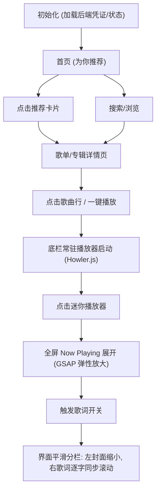

# MYMUSIC - Apple Music 风格个人音乐播放网站 PRD

## 1. 产品概述

本产品是一款深度复刻 **Apple Music** 视觉语言与交互灵魂的个人沉浸式音乐播放网站。项目前端集成网易云音乐高级 API，后端通过自建代理服务进行安全鉴权。产品以极致的流体动效、毛玻璃微观视觉、响应式弹性布局为核心体验，旨在将网易云音乐的丰富曲库转化为桌面端优先的高品质、高美学价值的独立音乐客户端。

- **目标用户**：个人音乐爱好者、数字美学追求者、高品质 UI/UX 强迫症用户。
- **核心价值**：完美还原 Apple Music 经典的流体渐变背景、歌词渐变消隐、封面播放联动以及极简的黄金排版，提供无缝、丝滑的沉浸式听歌体验。

---

## 2. 功能模块与页面详情

### 2.1 用户角色定义

| 角色 | 说明 |
| --- | --- |
| **私有化宿主** | 无需在前端开放注册。网站宿主通过在后端 `.env` 配置文件中写入个人的网易云音乐高级凭证（Cookie/AppID/Keys），即可使前端所有访问者共享完整的个性化推荐、私歌单及全部曲库权益。 |

### 2.2 页面功能矩阵

| 页面名称 | 模块名称 | 功能描述 | 视觉/交互要点 (对标 Apple Music) |
| --- | --- | --- | --- |
| **全域组件** | 侧边导航栏 | 提供全局路由跳转及个人歌单快捷入口。 | 240px 固定宽，半透明毛玻璃，选中项呈现官方红（#FA586A）并带弹性胶囊背景。 |
| **全域组件** | 底部播放栏 | 常驻迷你播放器，显示当前曲目并提供基础控制。 | 72px 高，置顶 2px 极细红色无滑块进度条；封面图极小，支持点击平滑展开。 |
| **首页** `/` | 为你推荐 | 展示高度定制化的个性化内容。 | 顶部包含大号加粗的今日日期/问候语；全屏横向滚动卡片，支持鼠标滚轮横向穿透。 |
| **首页** `/` | 最近播放 | 记录用户最近的播放历史轨迹。 | 响应式正方形卡片网格，Hover 时触发微悬浮阴影。 |
| **浏览页** `/browse` | 探索大厅 | 分类浏览、排行榜、新碟上架。 | 胶囊状横向风格标签；官方排行榜采用「大封面 + 前三名歌曲列表」并列排版。 |
| **搜索页** `/search` | 全局搜索 | 实时检索歌曲、歌手、专辑、歌单。 | 巨幅搜索框，聚焦时带脉冲发光；提供流式标签的热门搜索词。 |
| **歌单/专辑详情** `/playlist/:id` `/album/:id` | 详情大图 | 展示单张歌单或专辑的完整曲目。 | 顶部采用「大封面 + 动态提取色彩渐变背景」，支持一键「播放」与「随机播放」双大按钮。 |
| **全屏播放页** `/now-playing` | 沉浸式视窗 | 核心全屏组件（基于路由或模态覆盖层）。 | **双态切换**：1. 封面居中状态（大封面 + 动感阴影）2. 歌词分栏状态（左封面缩小，右歌词流式滚动）。 |

---

## 3. 核心业务流程



---

## 4. 极致视觉与 UI 设计规范

### 4.1 视觉调色板与材质

- **背景体系**：
  - **基础背景**：纯黑深邃色系（`#000000` ~ `#121212`）
  - **半透明雾面 (Mica Material)**：`rgba(255, 255, 255, 0.06)` 配合 `backdrop-filter: blur(30px);`

- **品牌强调色**：
  - Apple Music 官方红（`#FA586A`）
  - 渐变辅助色：粉紫渐变群（`#FA586A` → `#C084FC` → `#6366F1`）

- **排版字体**：
  - **英文字体**：`SF Pro Display` (标题) / `SF Pro Text` (正文)
  - **中文字体**：`PingFang SC` / `System-UI` 降级，严格遵循苹果系统的字重级联体系。

- **圆角规范**：
  - 外层大卡片/专辑封面：`12px` ~ `16px`
  - 交互按钮/风格胶囊：`999px` (全圆角)

### 4.2 核心组件视觉细节设计

> **专辑封面三维投影 (3D Floating Shadow)**
> 全屏播放页的专辑封面严禁使用扁平设计，必须采用多重阴影交织：
> `box-shadow: 0 20px 40px rgba(0,0,0,0.6), 0 0 80px rgba(封面主色调, 0.3);`
> 营造出封面悬浮于流体背景之上的三维视觉深度。

> **边缘消隐渐变遮罩 (Mask Fade Overflow)**
> 凡是涉及到滚动区域（如歌词滚动组件、右侧待播清单列表），其滚动视窗的顶部与底部必须应用 CSS 渐变遮罩，使歌词和文字在移出视窗时呈现自然淡出的半透明烟雾效果：
> `mask-image: linear-gradient(to bottom, transparent 0%, white 10%, white 90%, transparent 100%);`

---

## 5. 顶级动画与交互特效设计 (anime.js + GSAP)

为彻底对标 Apple Music 的丝滑感，系统动画严禁采用线性变色或生硬闪现，必须全部引入基于物理特性的弹性曲线（Spring Easing）。

### 5.1 动态流体氛围背景 (Fluid Gradient Engine)

- **实现方案**：全屏播放页背景不采用静态的高斯模糊。提取当前专辑封面的 3~4 种核心主色调，绘制于 Canvas 或多层 CSS Webkit 滤镜上。
- **动效描述**：利用 **GSAP** 驱动色块的 `transform: translate()`、`scale()` 与 `rotate()` 属性，以 10~15 秒为周期进行极慢速的网格变形与融合，模拟 Apple Music 随音乐流动的绚丽液体氛围。

### 5.2 封面状态联动呼吸动画 (Cover Scaling Analytics)

- **播放态**：当音乐点击**播放**时，GSAP 在 450ms 内将封面等比例平滑放大 `10%`，同时扩散其背后的氛围色彩阴影，模拟「乐曲响起，封面浮起」的动态反馈。
- **暂停态**：当点击**暂停**时，封面在 300ms 内优雅收回，等比例缩小 `10%`，背部阴影收敛，模拟「音乐停止，封面归位」。

### 5.3 沉浸式全屏流体展开 (Shared Element Transition)

- **动效描述**：点击底部迷你播放器时，不触发页面硬刷新。迷你播放器的小封面作为"共享元素"，通过 GSAP Flip 动画直接从底部弹跳、并平滑放大至全屏中央（或左侧），全屏流体背景同步从底部向上晕染晕开，耗时 500ms，配合 `power4.out` 缓动。

### 5.4 动态逐字卡拉OK歌词流 (Fluid Kinetic Lyrics)

- **滚动机制**：当歌曲进度更新时，**anime.js** 精确计算当前行距离视窗中心的偏移量，平滑平移歌词容器，使当前句始终垂直居中。
- **字级渲染**：解析网易云 `yrc`（逐字时序数据）。当前播放到的字或词，高亮颜色从次要文字灰（`rgba(255,255,255,0.4)`）瞬间流式变为纯白色（`#FFFFFF`），并伴随微小的字重加粗或字号放大；未播放的歌词行则施加 `filter: blur(1px);` 的微模糊与低透明度处理，大幅强化视觉焦点。

---

## 6. 技术架构映射与数据保障

### 6.1 播放器状态机对标设计 (Zustand)

为完美支撑全屏页面的交互，`playerStore` 状态机必须支持完整的**待播清单 (Up Next)** 调度机制：

```typescript
interface PlayerState {
  currentSong: Song | null;
  playlist: Song[];       // 原始播放列表
  queue: Song[];          // 动态待播清单 (Up Next)
  isPlaying: boolean;
  currentTime: number;
  duration: number;
  playbackMode: 'sequence' | 'shuffle' | 'repeat-one' | 'repeat-all';

  // 核心动效控制联动桩
  coverVisualState: 'expanded' | 'collapsed';
  lyricLayoutMode: 'centered-cover' | 'split-lyrics';
}
```

### 6.2 代理端 (Express) 数据对齐修正

针对前述网易云 API 的技术特性，本地 Express 代理层需完成以下对齐补强：

1. **身份持久化注入**：代理服务在转发 `GET /api/recommend/*` 等需要登录态的接口时，自动在 Headers 中追加配置好的私有高等级账户 `Cookie`，确保前端无需登录即可稳定渲染高品质的个性化"为你推荐"数据。
2. **高级歌词格式解析**：`GET /api/lyric?id=xxx` 接口在返回标准 `lrc` 的同时，代理层优先抓取并向前端输出包含逐字时间戳的 `yrc` 格式数据。若该曲目无逐字数据，则启动平滑平降机制，由前端 anime.js 针对整行进行 300ms 的平滑淡入渐变，确保动画不卡顿。