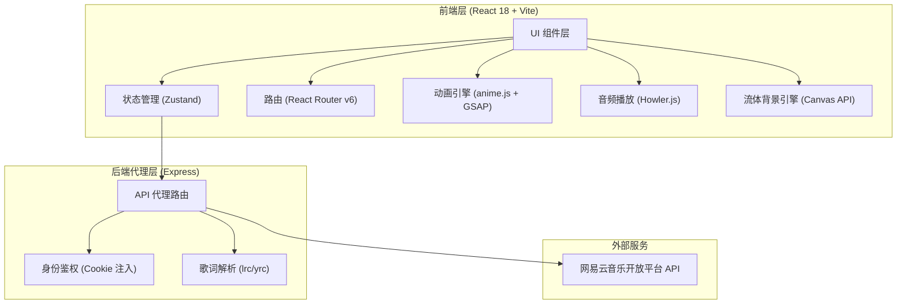

# MYMUSIC - 技术架构文档

## 1. 架构设计



## 2. 技术栈说明

| 层级 | 技术 | 版本 | 说明 |
|------|------|------|------|
| 前端框架 | React + TypeScript | 18.x | UI 组件化开发 |
| 构建工具 | Vite | 5.x | 极速开发与构建 |
| 样式方案 | TailwindCSS | 3.x | 原子化 CSS + 自定义主题 |
| 状态管理 | Zustand | 4.x | 轻量响应式状态机 |
| 路由 | React Router | 6.x | SPA 路由管理 |
| 动画引擎 | GSAP (含 ScrollTrigger / Flip) | 3.x | 弹性动画、共享元素过渡 |
| 动画引擎 | anime.js | 3.x | 歌词逐字动画、精确时间轴 |
| 音频播放 | Howler.js | 2.x | 跨浏览器 Web Audio 控制 |
| HTTP 客户端 | Axios | 1.x | API 请求 |
| 图标库 | Lucide React | latest | Apple 风格线性图标 |
| 颜色提取 | node-vibrant (后端) | 3.x | 封面主色调提取 |
| 后端框架 | Express + TypeScript | 4.x | API 代理与鉴权 |
| 网易云 API | NeteaseCloudMusicApi | latest | 开放平台接口封装 |

## 3. 路由定义

| 路由 | 页面 | 说明 |
|------|------|------|
| `/` | 首页（为你推荐） | 默认首页，个性化推荐内容 |
| `/browse` | 浏览页 | 分类浏览、排行榜、新碟上架 |
| `/search` | 搜索页 | 全局搜索 |
| `/playlist/:id` | 歌单详情 | 歌单完整曲目列表 |
| `/album/:id` | 专辑详情 | 专辑完整曲目列表 |
| `/now-playing` | 全屏播放页 | 沉浸式播放界面（模态覆盖层） |

## 4. API 定义

### 4.1 代理服务接口

所有网易云 API 请求通过本地 Express 代理转发，自动处理签名和 Cookie 注入。

```typescript
// === 搜索类 ===
GET  /api/search?keyword=xxx&type=song&limit=20     // 综合搜索
GET  /api/search/hot                                  // 热门搜索关键词
GET  /api/search/suggest?keyword=xxx                  // 搜索建议

// === 歌单/专辑 ===
GET  /api/playlist/detail?id=xxx                      // 歌单详情（含歌曲列表）
GET  /api/album?id=xxx                                // 专辑详情

// === 歌曲 ===
GET  /api/song/detail?ids=xxx                         // 歌曲详情
GET  /api/song/url?id=xxx                             // 歌曲播放 URL

// === 歌词 ===
GET  /api/lyric?id=xxx                                // 返回 { lrc, yrc?, tlyric? }

// === 推荐类（需 Cookie 注入）===
GET  /api/recommend/playlist                          // 每日推荐歌单
GET  /api/recommend/songs                             // 每日推荐歌曲

// === 排行榜/分类 ===
GET  /api/top/playlist?cat=xxx&limit=20               // 热门歌单
GET  /api/top/album?limit=20                          // 新碟上架
GET  /api/toplist                                     // 所有排行榜
GET  /api/top/songs?type=xxx                          // 排行榜歌曲

// === 用户私有（需 Cookie 注入）===
GET  /api/user/playlist?uid=xxx                       // 用户歌单列表
GET  /api/user/recent                                 // 最近播放
GET  /api/user/likelist                               // 喜欢列表
```

### 4.2 TypeScript 类型定义

```typescript
// === 歌曲 ===
interface Song {
  id: number;
  name: string;
  artists: Artist[];
  album: Album;
  duration: number;       // 毫秒
  url?: string;           // 播放地址（动态获取）
  privilege?: {
    st: number;           // 0=免费 其他=付费/无版权
    flag: number;
  };
}

// === 歌手 ===
interface Artist {
  id: number;
  name: string;
  picUrl?: string;
  alias?: string[];
}

// === 专辑 ===
interface Album {
  id: number;
  name: string;
  picUrl: string;
  publishTime: number;
  company?: string;
}

// === 歌单 ===
interface Playlist {
  id: number;
  name: string;
  coverImgUrl: string;
  description: string;
  trackCount: number;
  playCount: number;
  tracks: Song[];
  creator: { nickname: string; avatarUrl: string };
  tags: string[];
}

// === 歌词 ===
interface LyricData {
  lrc: LrcLine[];        // 行级歌词
  yrc?: YrcWord[];       // 逐字歌词（优先）
  tlyric?: LrcLine[];    // 翻译歌词
}

interface LrcLine {
  time: number;           // 毫秒
  text: string;
}

interface YrcWord {
  time: number;           // 起始毫秒
  duration: number;       // 持续毫秒
  text: string;
}

// === 播放器状态 ===
interface PlayerState {
  currentSong: Song | null;
  playlist: Song[];
  queue: Song[];                    // 动态待播清单 (Up Next)
  isPlaying: boolean;
  currentTime: number;
  duration: number;
  volume: number;
  playbackMode: 'sequence' | 'shuffle' | 'repeat-one' | 'repeat-all';

  // 动效控制桩
  coverVisualState: 'expanded' | 'collapsed';
  lyricLayoutMode: 'centered-cover' | 'split-lyrics';
}
```

## 5. 数据模型

### 5.1 Zustand Store 设计

```
playerStore
├── currentSong: Song | null
├── playlist: Song[]               // 当前播放列表（原始顺序）
├── queue: Song[]                  // 动态待播队列 (Up Next)
├── isPlaying: boolean
├── currentTime: number            // 当前播放秒数
├── duration: number               // 总时长秒数
├── volume: number                 // 0-100
├── playbackMode: enum
├── coverVisualState: enum         // 'expanded' | 'collapsed'
├── lyricLayoutMode: enum          // 'centered-cover' | 'split-lyrics'
├── playSong(song: Song, list?: Song[]): void
├── togglePlay(): void
├── next(): void
├── prev(): void
├── seekTo(time: number): void
├── setVolume(vol: number): void
├── cyclePlaybackMode(): void
├── addToQueue(song: Song): void
├── removeFromQueue(index: number): void
└── clearQueue(): void

uiStore
├── isNowPlayingOpen: boolean
├── isSidebarCollapsed: boolean
├── homeGreeting: string           // 动态问候语
├── openNowPlaying(): void
├── closeNowPlaying(): void
├── toggleNowPlaying(): void
├── toggleLyricMode(): void
└── toggleSidebar(): void
```

## 6. 项目目录结构

```
mymusic/
├── client/                          # React 前端
│   ├── public/
│   │   └── fonts/                   # SF Pro 字体文件
│   ├── src/
│   │   ├── components/
│   │   │   ├── Layout/
│   │   │   │   ├── Sidebar.tsx      # 侧边导航栏
│   │   │   │   ├── BottomBar.tsx    # 底部播放栏
│   │   │   │   └── MainLayout.tsx   # 主布局容器
│   │   │   ├── Player/
│   │   │   │   ├── NowPlaying.tsx   # 全屏播放器
│   │   │   │   ├── FluidBackground.tsx  # 流体背景引擎
│   │   │   │   ├── VinylCover.tsx   # 封面组件（呼吸动画）
│   │   │   │   ├── LyricView.tsx    # 歌词视图（逐字高亮）
│   │   │   │   └── PlayerControls.tsx   # 播放控制按钮组
│   │   │   ├── Cards/
│   │   │   │   ├── PlaylistCard.tsx # 歌单卡片
│   │   │   │   ├── AlbumCard.tsx    # 专辑卡片
│   │   │   │   └── SongCard.tsx     # 歌曲卡片
│   │   │   └── common/
│   │   │       ├── ProgressBar.tsx  # 进度条
│   │   │       ├── SearchInput.tsx  # 搜索框
│   │   │       └── ScrollMask.tsx   # 边缘消隐遮罩
│   │   ├── pages/
│   │   │   ├── Home.tsx             # 首页 / 为你推荐
│   │   │   ├── Browse.tsx           # 浏览页 / 探索大厅
│   │   │   ├── Search.tsx           # 搜索页
│   │   │   ├── PlaylistDetail.tsx   # 歌单详情
│   │   │   └── AlbumDetail.tsx      # 专辑详情
│   │   ├── stores/
│   │   │   ├── playerStore.ts       # 播放器状态机
│   │   │   └── uiStore.ts           # UI 状态
│   │   ├── services/
│   │   │   └── api.ts               # Axios 封装 + API 方法
│   │   ├── hooks/
│   │   │   ├── usePlayer.ts         # 播放器控制 hook
│   │   │   ├── useFluidBg.ts        # 流体背景 hook
│   │   │   └── useLyricSync.ts      # 歌词同步 hook
│   │   ├── types/
│   │   │   └── index.ts             # 全局类型定义
│   │   ├── utils/
│   │   │   ├── format.ts            # 时间/数字格式化
│   │   │   └── color.ts             # 颜色工具
│   │   ├── animations/
│   │   │   ├── sharedElement.ts     # GSAP Flip 共享元素过渡
│   │   │   ├── coverBreath.ts       # 封面呼吸动画
│   │   │   └── pageTransition.ts    # 页面过渡动画
│   │   ├── App.tsx
│   │   ├── main.tsx
│   │   └── index.css                # Tailwind + 自定义变量
│   ├── index.html
│   ├── tailwind.config.ts
│   ├── tsconfig.json
│   └── vite.config.ts
├── server/                          # Express 代理服务
│   ├── src/
│   │   ├── index.ts                 # 服务入口
│   │   ├── routes/
│   │   │   ├── search.ts
│   │   │   ├── playlist.ts
│   │   │   ├── song.ts
│   │   │   ├── lyric.ts
│   │   │   ├── recommend.ts
│   │   │   └── user.ts
│   │   ├── services/
│   │   │   └── netease.ts           # 网易云 API 封装 + 签名
│   │   ├── middleware/
│   │   │   ├── auth.ts              # Cookie 注入中间件
│   │   │   └── lyricParser.ts       # yrc 歌词解析中间件
│   │   └── utils/
│   │       └── crypto.ts            # 加密/签名工具
│   ├── tsconfig.json
│   └── .env                         # 凭证配置
├── package.json                     # 根 monorepo 脚本
└── .env.example
```

## 7. 环境变量配置 (.env)

```env
# 网易云音乐 API 凭证
NETEASE_APP_ID=b3010d00000000004b272f59252e39ee
NETEASE_APP_SECRET=deded0f78720f99b681282e0124d3f25
NETEASE_PUB_KEY=MIIBIjANBgkqhkiG9w0BAQEFAAOCAQ8AMIIBCgKCAQEA0rV4IJp8PJxoNpNCaVU8XVvAROWAeDXowHAbUQQ9Lc2zWSFAlsqOpejAXr/EZV5TfzZvDXs+gVKGopuZzhTFC82vuv5nNPdtDj5Ol2ZQtQt+keHs+KDwNF5KNyAA5shv6MKR8qVuawm8mBsvlDZwAO4m46jtd8oceHQhHiY7cb9XppMP0MRQvBXIwWO/zegEEVlqJ5dcHigbV05wDuX3EvDxjMFO5fB4s0oDYYFq5w493URjKW0zXjvtZhgPBpKbKtjZyaUsN891YD2u9wV6DnjOeOWxskBbm/kJvu5OJ2X6/ERzHUkUWZ5N2Ur8Q04i0jzjvhd82Re5Rcrs9fPPkwIDAQAB
NETEASE_PRIVATE_KEY=MIIEvQIBADANBgkqhkiG9w0BAQEFAASCBKcwggSjAgEAAoIBAQDStXggmnw8nGg2k0JpVTxdW8BE5YB4NejAcBtRBD0tzbNZIUCWyo6l6MBev8RlXlN/Nm8Nez6BUoaim5nOFMULza+6/mc0920OPk6XZlC1C36R4ez4oPA0Xko3IADmyG/owpHypW5rCbyYGy+UNnAA7ibjqO13yhx4dCEeJjtxv1emkw/QxFC8FcjBY7/N6AQRWWonl1weKBtXTnAO5fcS8PGMwU7l8HizSgNhgWrnDj3dRGMpbTNeO+1mGA8Gkpsq2NnJpSw3z3VgPa73BXoOeM545bGyQFub+Qm+7k4nZfr8RHMdSRRZnk3ZSvxDTiLSPOO+F3zZF7lFyuz188+TAgMBAAECggEAIbJPrGHIQyZ9gVd6JBTeJc1J1DrM7sHVn7YjSDOLV8sw8VdgrZIQefaHknTMgwGGDNlhrSBBK2FNPVfw+C9Yy73Fv/vLTtcleO+nQI27k8MWJ1z1ZAAo1IHNEJUXpSX3b5vIx1XZcK4Km7CiopXfbOapECNbG/BrLoAz2PnNloT0Gv3zVe8gvUjsw62EU0oVC/7OGyGHdYo2StaHOPTO+9JHFop7gnSx0wsfPr6wZrS8BCxeNfdjX1fp9LWBv1zUXGWJcyAU9+tWPmD8vxnJ6D26b26qpXmXddZq5Xmvx689m1YceRMw5a3nLPauUabUXWw83jMjXh7BUdb3qRgEIQKBgQDpYUkL43trZ/PtBgJ71Kk0ItIVlpsdwr/BXHNza55a9A29XBId74pyNU0thk42t2/vYFobZ/4TiAiH+eJz8zSzYStqLozp7Qkd0AGxeK56ReQyVyJx1F9W3gIn/BJUQ3yATL7a97M9s3Y8WenN9OcTDr1tSR3bl3JB4Wtqvs+q+QKBgQDnIaiReEXywLjLBrPfueg45W31HIPf3iSpxzcajDiMdNYCCCoA6w9Wy3GNO6rxvviI3Cq5CO4wGlFTsMcoJ6R8oDA/qn6Z7qpQOe6Qqmx4J1ysnY8XDkC2dnbrwxsHjTUm26iDA4s0quh9v5c6gtdndn4ezlde8zQcdtktopMF6wKBgFhJ9pFp0LIUVIJRqLTiAdT4a1PBcxMyLsrex8pdZz3vYBdH8o6ipVSJd5YGXiZzBQShBdWiZMtMxjVywkmtMz29P+heje6dPrqpi0pxZkhZkne84QoBFsRNHrGzuddo5HvBDN7XoFZyQwOX3EyPHq/l/qGObJ47T/0+Yx2x6+w5AoGBAN1yczaFPMd7/NGQ53AYh7VTpIluu68XAJumIlaOOHPiUVT7C3t7u2OWYoJFw+AA79D42PoV41g1Lux3eCkx6jf5pqCpMsk7UPSyvK7gijKIzBMalokpf7kSQZhbg581nNJRLN/x2kMo6L3qffNyfv1DG01at31imPAYsrY1iJXnAoGANBEZCv3u0G6s5w1YXoDq6yhb2gjSlgSLgR/b2NmYURziEz+aI7ag9CmuCjLthS8N69MzhiIMrUSyPF/LNeknUfA9W3SsDm/8OhBbk8ZfpAQGV6/f25ZGni0ULpPWZAWkK/CcCC6qm9xjUL0Rs0qx7TELzdGbo01T+3PEZByd45M=

# 私有账户 Cookie（用于推荐/收藏等需登录接口）
NETEASE_COOKIE=your_netease_cookie_here

# 服务端口
PORT=3001
```