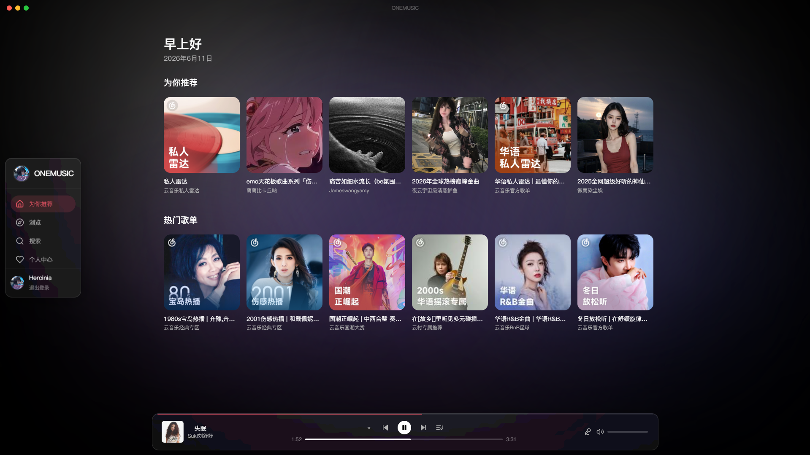
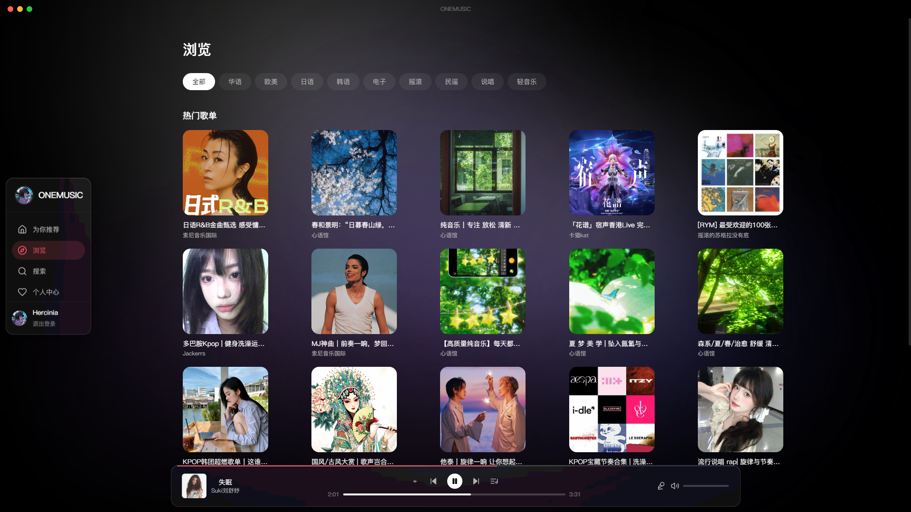
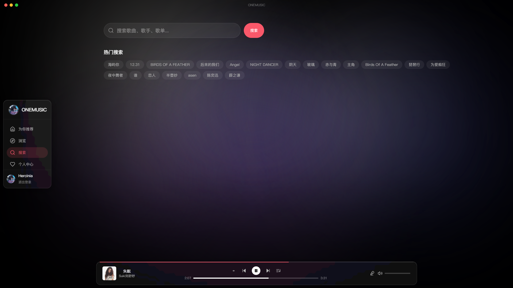
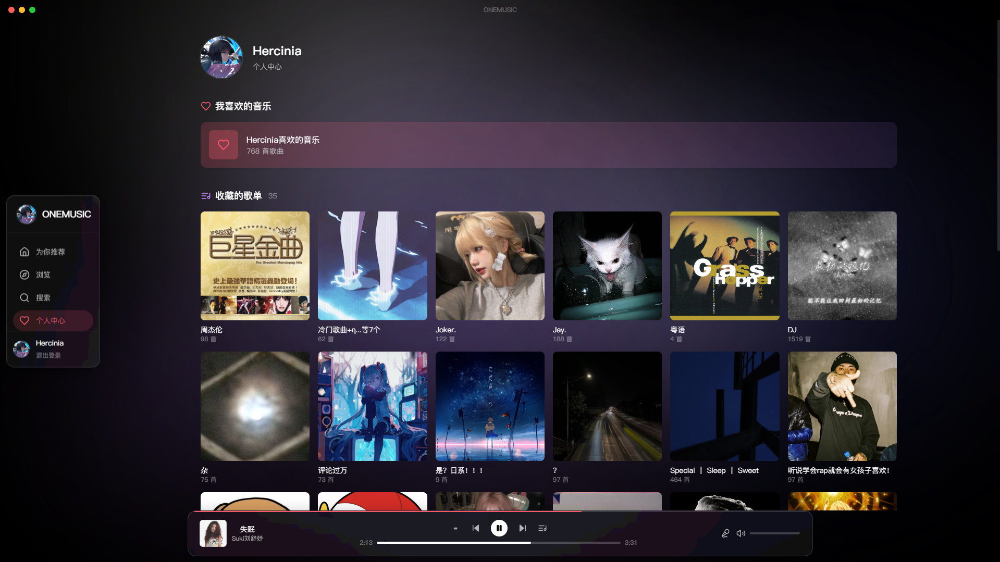

# 🎵 ONEMUSIC

> Apple Music 风格个人沉浸式音乐播放器，集成网易云音乐 API

ONEMUSIC 是一款深度复刻 Apple Music 视觉语言与交互灵魂的音乐播放器。放弃臃肿的客户端界面，回归纯粹听歌体验。

## 📸 预览

<p align="center">
  
  
</p>

<p align="center">
  
  
</p>

<p align="center">
  
</p>

## ✨ 核心特性

- **流体背景取色** — 从当前播放封面实时取色，色彩在屏幕上缓慢漂移流动，每首歌都有属于自己的颜色
- **Apple Music 视觉复刻** — 毛玻璃面板、红紫渐变品牌色、SF Pro 字体风格
- **封面呼吸动画** — GSAP 驱动的封面缩放呼吸效果
- **歌词逐字高亮** — 基于 AMLL 引擎，YRC 格式精准时间轴，每个字卡在节拍上亮起
- **模式切换动画** — 封面模式 ↔ 歌词分栏模式，anime.js 驱动丝滑过渡
- **全屏播放器** — 完整的 NowPlaying 体验，含播放控制、进度条、音量调节
- **Electron 桌面端** — 支持 Windows / macOS / Linux，macOS 风格交通灯窗口控制
- **网易云音乐集成** — 搜索、歌单、专辑、推荐、排行榜、用户收藏等完整 API
- **QR 码扫码登录** — 支持网易云音乐账号扫码登录，收藏自动同步
- **图片/音频代理** — 服务端流式转发，绕开 CDN 跨域限制

## 🛠 技术栈

| 层级 | 技术 | 版本 |
|------|------|------|
| 前端框架 | React + TypeScript | 18.x |
| 构建工具 | Vite | 5.x |
| 样式方案 | TailwindCSS | 3.x |
| 状态管理 | Zustand | 5.x |
| 路由 | React Router | 7.x |
| 动画引擎 | GSAP + anime.js | 3.x |
| HTTP 客户端 | Axios | 1.x |
| 桌面端 | Electron | 28.x |
| 后端框架 | Express + TypeScript | 4.x |

## 🚀 快速开始

```bash
git clone https://github.com/Alex234123/ONEMUSIC.git
cd ONEMUSIC
npm install
npm run dev          # 同时启动前端 :5173 + 后端 :3001
npm run electron:dev # 启动 Electron 桌面端
```

## 📦 桌面端构建

```bash
npm run electron:build
```

构建产物输出到 `release4/` 目录。

## ⚙️ 环境配置

在项目根目录 `.env` 中配置网易云凭证：

```env
NETEASE_COOKIE=xxx    # 网易云音乐账号 Cookie
PORT=3001
```

## 📄 开源协议

本项目源码完全开源，欢迎 Star ⭐ 和 Fork 🍴
